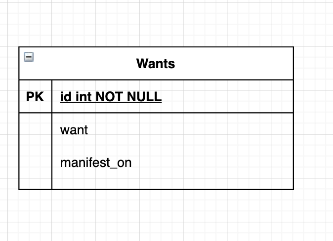

# Dre app

[](https://github.com/adoubleyoueye/Dreamcast/actions/workflows/lint.yml) [](https://github.com/adoubleyoueye/Dreamcast/actions/workflows/test.yml)

### About


### Run the app in terminal

1. Start a Postgres database server on your machine or in the cloud.
2. Set the following environment variables in your terminal.

```
export POSTGRES_HOST=<address-where-database-running>
export POSTGRES_PORT=<port-where-database-running>
export POSTGRES_DB=<database-name>
export POSTGRES_USER=<username-for-database>
export POSTGRES_PASSWORD=<password-to-database>
```

3. Install packages and start the application server.

```
$ make install
$ make migrate
$ make run
```

### Run the app inside a Docker container

1. Build the docker container and get it up and running.

```
$ docker-compose build
$ docker-compose up
```

2. Setup database tables by running migrations.

```
$ docker-compose exec web python manage.py makemigrations
$ docker-compose exec web python manage.py migrate
```

### Make API calls against the server

Go to [http://localhost:8000/graphql](http://localhost:8000/graphql)

#### CRUD

##### Read

Fetching "graphs"

Our Dreamcast app has only one table, wants. This is what our API "schema" looks like:



This GraphQL query will fetch all the wants and the manifested date.

```
{
  allWants {
    edges {
      node {
        id
        want
        manifestedOn
      }
    }
  }
}

```


##### Create

** API call to create a want.**

```
mutation {
  createWants(input: {data: {want: "hello"}}) {
    wants {
      want
    }
  }
}

```

##### update

```
mutation {
  updateWants(input: {id: "xxxx", data: {want: "Ask the universe for what you want, not for what you don’t want"}}) {
    wants {
      want
    }
  }
}
```

### Run tests and check code coverage

```
$ make test
$ make coverage
```

### Lint your code

```
$ make lint
```
